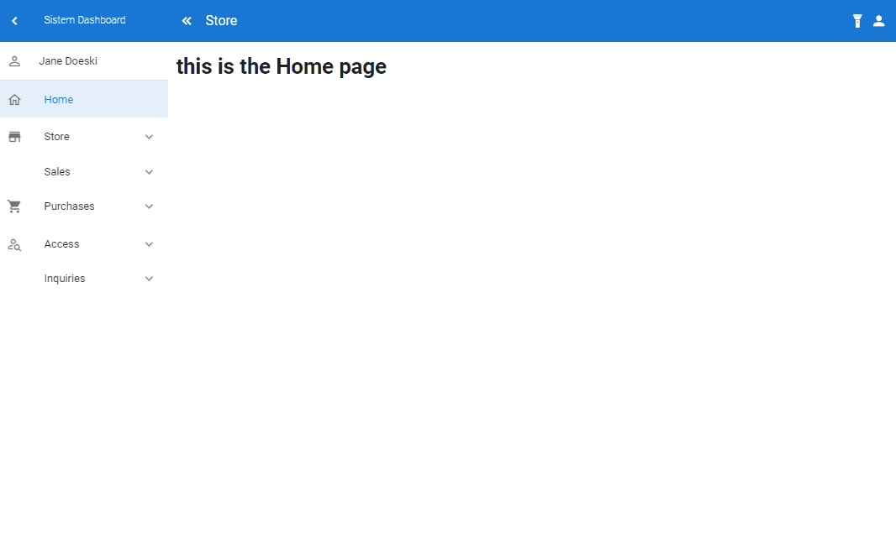
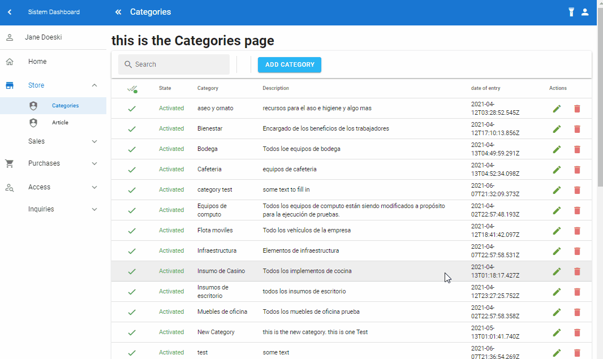
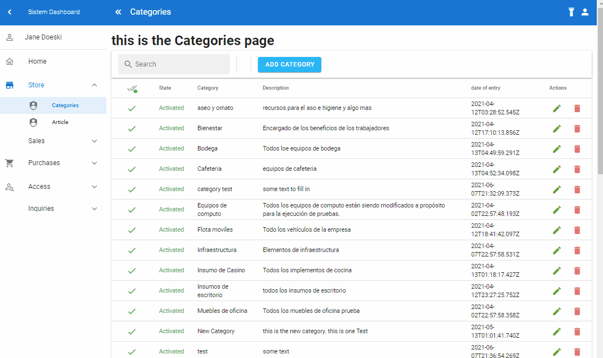
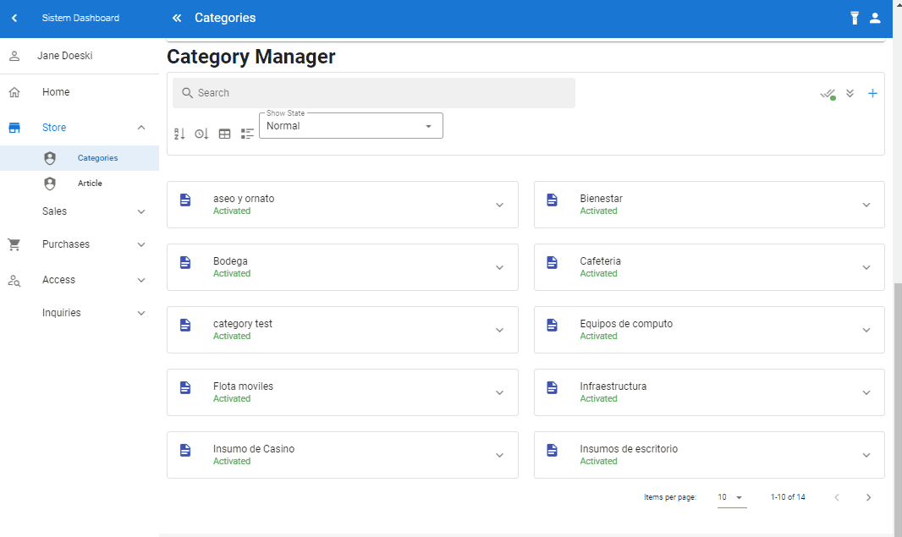

# proyecto-vue

# Título del Proyecto
 Proyecto MEVN 

 ## Construido con 🛠️

* [MongoDB](https://www.mongodb.com/es) - Base de Datos no relacional.
* [Express Js](https://expressjs.com/es/) - infraestructura de aplicaciones web Node.js
[Vue CLI](https://cli.vuejs.org/) - Command line interface Vue 
* [VueJS](https://vuejs.org/v2/guide/)- Framework Vuejs v2
* [Vue Router](https://router.vuejs.org/)- 0fficial router for Vue.js 
* [Vuex](https://vuex.vuejs.org/)- State management pattern 
* [Vuetify](https://vuetifyjs.com/en/) - Vue UI Library
* [Axios](https://axios-http.com/docs/intro) - HTTP Client for node.js
* [Nodejs](https://nodejs.org/es/) - Entorno de ejecución de JavaScript orientado a eventos asíncronos

CRUD lists:


Modals:


Control Actived Desactive Category:


version 2 CRUD list:

## Project setup
```
npm install
```

### Compiles and hot-reloads for development
```
npm run serve
```

### Compiles and minifies for production
```
npm run build
```

### Customize configuration
See [Configuration Reference](https://cli.vuejs.org/config/).
